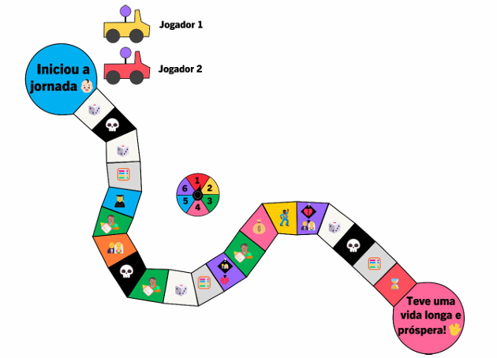

# Jogo-da-Vida-
Trabalho do Grau A pela faculdade de Análise e desenvolvimento de sistemas da disciplina Fundamentos de Programação 2024/1
Nome do Aluno: Pettersom Pinheiro Polonio

Instruçôes de uso do programa:
Imagem do tabuleiro:

Regras do tabuleiro:
1 Jogador por vez, pressione enter a cada vez que girar a roleta para confirmar e conferir em que casa você está>
Essas são as regras de cada posição do jogo:

---Casa 1:---
Rode a roleta. Se parar no 1, avance 1 casa. Se parar no 3, volte 1 casa.
Se parar no 6, perde uma rodada no jogo em dupla.

---Casa 2:---
Morreu! Game Over

---Casa 3:---
Rode a roleta. Se parar no 1, avance 1 casa. Se parar no 3, volte 1 casa.
Se parar no 6, perde uma rodada no jogo em dupla.

---Casa 4:---
Desafio matemático!! Girar a roleta e ver qual número cai:
1 - Mostrar na tela os números primos até 100
2 - Fazer o somatório dos nůmeros de 1 ate 10
3 - Imprimir a sérle de Fibonacci atê o décimo elemento
4 - Calcular a área de um circulo com ralo 2.5
5 - Imprimir o fatorial de 5
6 - Imprimir os 5 primeiros numeros divisiveis por 2 e por 5.

---Casa 5:---
Se formou !! Gire a roleta e veja qual curso você se formou.
1 - Direito
2 - Medicina
3 - Jogos digitais
4 - Jogador escolhe a profissão
5 - Administração
6 - Análise e desenvolvimento de sistemas

---Casa 6:---
Teve fiho !!! Jogue o dado e se sair o nro 5, são gêmeos! Nos outros
casos, apenas 1 filho

---Casa 7:--- 
Casou!

---Casa 8:---
Morreu! Game Over

---Casa 9:---
Teve fiho !!! Jogue o dado e se sair o nro 5, são gêmeos! Nos outros casos, apenas 1 filho

---Casa 10:---
Rode a roleta. Se parar no 1, avance 1 casa. Se parar no 3, volte 1 casa.
Se parar no 6, perde uma rodada no jogo em dupla.

---Casa 11:---
Desafio matemático!! Girar a roleta e ver qual número cai:
1 - Mostrar na tela os números primos até 100
2 - Fazer o somatório dos nůmeros de 1 ate 10
3 - Imprimir a sérle de Fibonacci atê o décimo elemento
4 - Calcular a área de um circulo com ralo 2.5
5 - Imprimir o fatorial de 5
6 - Imprimir os 5 primeiros numeros divisiveis por 2 e por 5.

---Casa 12:---
Divórcio !!

---Casa 13:---
Teve fiho !!! Jogue o dado e se sair o nro 5, são gêmeos! Nos outros casos, apenas 1 filho

---Casa 14:---
Ganhou na loteria!!!
Você girou a roleta e ganhou o seguinte:
1 - Ganha R$ 2,50 no bolão
2 - Ganha R$ 5.000,00
3 - Ganha R$ 50,000,00
4 - Ganha RS 500.00,00
5 - Ganha R$ 5.000.000,00
6 - Ganha R$ 100,000.00,00

---Casa 15:---
Você ficou famoso !

---Casa 16:---
Você Casou !

---Casa 17:---
Rode a roleta. Se parar no 1, avance 1 casa. Se parar no 3, volte 1 casa.
Se parar no 6, perde uma rodada no jogo em dupla.

---Casa 18:---
Morreu !! Game Over

---Casa 19:---
Desafio matemático!! Girar a roleta e ver qual número cai:
1 - Mostrar na tela os números primos até 100
2 - Fazer o somatório dos nůmeros de 1 ate 10
3 - Imprimir a sérle de Fibonacci atê o décimo elemento
4 - Calcular a área de um circulo com ralo 2.5
5 - Imprimir o fatorial de 5
6 - Imprimir os 5 primeiros numeros divisiveis por 2 e por 5.

---Casa 20:---
Maquina do tempo: volta para o inicio!!... Perde todos os
achievements, conjuge e filhos (deixam de existirl, Em outras palavtas
reseta tudo do plaver, mas o jogo não acaba.

****Casa 21****
Fim de Jogo !! Ganhador

